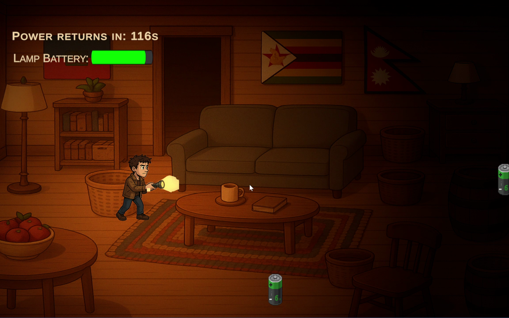
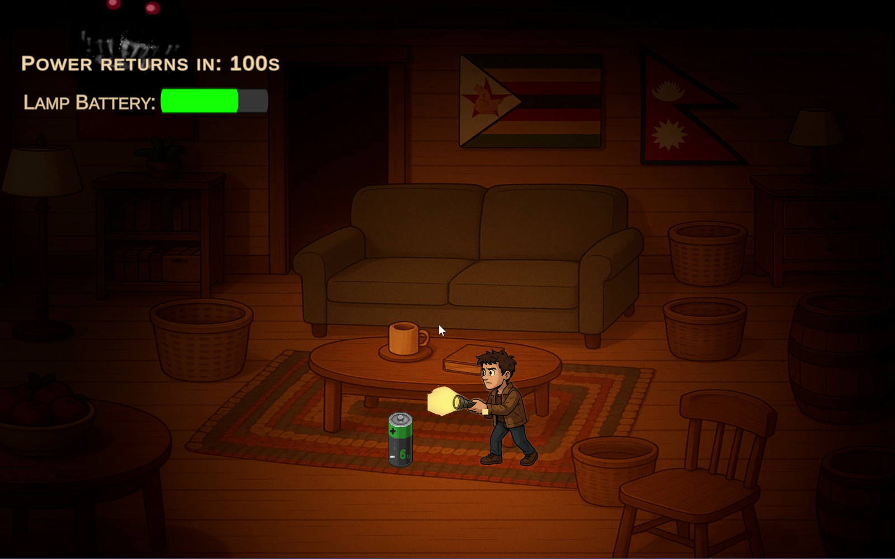
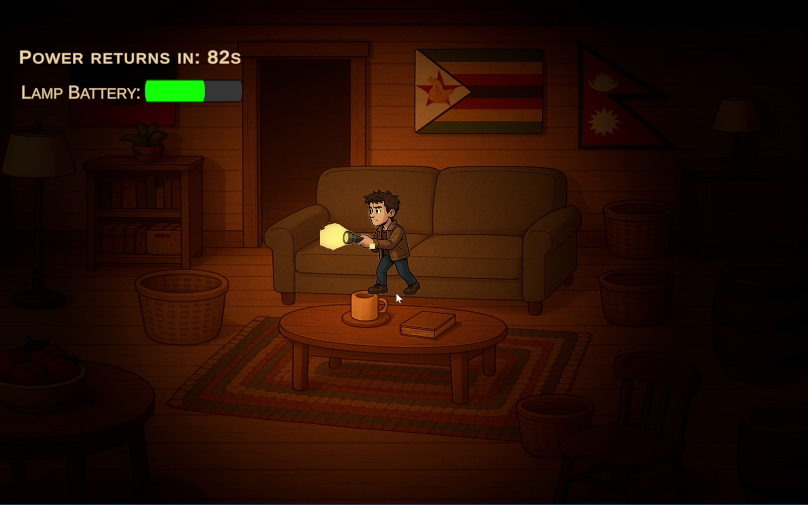
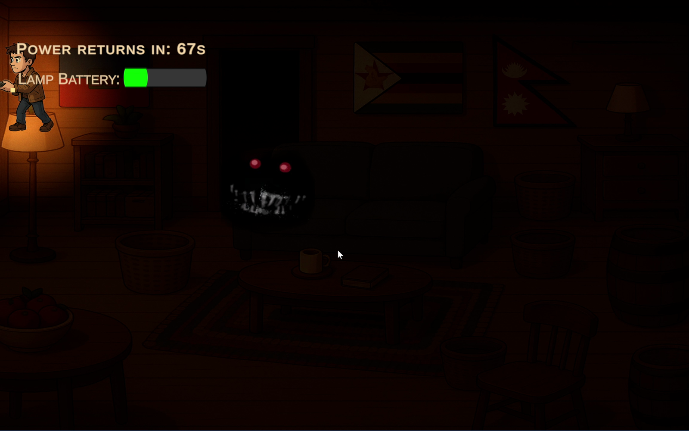
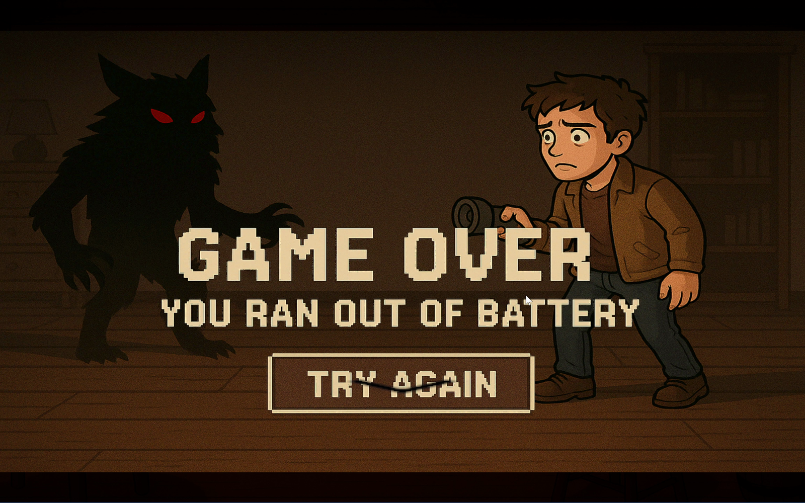

# 🔦 Black Out

> A 2D darkness-survival game built with Unity and C#, where light is a limited resource. Explore the blackout, collect batteries, keep creatures outside your shrinking safe zone, and survive until the power returns.

<p align="center">
  
</p>

<p align="center">
  
  
  
  
</p>

---

## About the Game

**Black Out** is a 2D survival game developed in **Unity using C#**, built around one central idea:

> **Your light is your survival resource.**

The player is trapped in darkness during a blackout. A limited light source provides visibility and creates a temporary safe area, but its radius continuously decreases as the blackout continues.

Batteries scattered around the environment restore the light, forcing the player to leave relative safety and explore the darkness for resources.

At the same time, a hostile creature reacts to the player's illuminated area and lurks around the edge of the light.

The goal is to keep the light alive long enough for the power to return.

---

## 🎮 Gameplay

The core survival loop combines exploration, resource management and enemy pressure.

```text
                  BLACKOUT
                      │
                      ▼
             Light Begins Draining
                      │
                      ▼
              Explore the Area
                      │
             ┌────────┴────────┐
             │                 │
             ▼                 ▼
        Find Battery       Avoid Threat
             │                 │
             ▼                 │
        Restore Light           │
             │                 │
             └────────┬────────┘
                      │
                      ▼
               Keep Surviving
                      │
           ┌──────────┴──────────┐
           │                     │
           ▼                     ▼
      Light Runs Out       Blackout Ends
           │                     │
           ▼                     ▼
       GAME OVER          POWER RESTORED
                                 │
                                 ▼
                                WIN
```

The shrinking light creates increasing pressure as the player must continually search for batteries while the safe illuminated area becomes smaller.

---

## 🎬 Full Gameplay Demo

The recorded gameplay demo shows the darkness mechanic, exploration, shrinking light radius, battery-resource system, enemy pressure, low-light state and game-over sequence.

<p align="center">
  <a href="docs/media/black-out-gameplay-demo.mp4">
    
  </a>
</p>

<p align="center">
  <strong>▶ Click the preview above to watch the gameplay demo with audio</strong>
</p>

The animated preview at the top provides a quick look at the gameplay, while the full recording preserves the atmospheric audio and complete recorded run.

> The recorded demo shows the game-over route. The alternative **Power Restored** victory condition is implemented in the game logic but is not shown in this recording.

---

## 💡 Light as a Survival Resource

The central mechanic is implemented using Unity's **2D lighting system**.

Instead of treating the player's light as a purely visual effect, the game treats its radius as a resource that continuously drains.

```text
Maximum Light
      │
      ▼
Light Radius Decreases
      │
      ▼
Visible / Safe Area Shrinks
      │
      ▼
Player Searches for Batteries
      │
 ┌────┴─────────┐
 │              │
 ▼              ▼
Battery      No Battery
 │              │
 ▼              ▼
Restore       Continue
 Light         Draining
 │              │
 └──────┬───────┘
        │
        ▼
 Continue Survival
```

<p align="center">
  
</p>

This connects the game's presentation directly to its mechanics: losing light does not simply make the screen darker — it reduces the player's effective survival space.

---

## 🔋 Battery System

Batteries are the player's primary survival resource.

Collecting a battery restores part of the player's light radius and gives the player more time to survive.

The battery system includes:

- Runtime battery spawning
- Randomised spawn positions
- Maximum active battery limits
- Timed spawning
- Battery pickup detection
- Light-radius restoration
- Pickup audio
- Cleanup of collected battery references

```text
Battery Spawns
      ↓
Random Position
      ↓
Player Explores
      ↓
Battery Discovered
      ↓
Pickup Triggered
      ↓
Light Restored
      ↓
Battery Removed
      ↓
New Resources Can Spawn
```

<p align="center">
  
</p>

This makes resource availability dynamic rather than relying entirely on a fixed set of manually positioned pickups.

---

## 👁️ Batteries Hidden by Darkness

Battery visibility is also connected to the player's light.

The game checks the distance between each battery and the player's current `Light2D` radius.

Conceptually:

```text
Battery Position
       +
Player Position
       ↓
Calculate Distance
       ↓
Compare With Light Radius
       │
   ┌───┴────┐
   │        │
Inside    Outside
Light      Light
   │        │
   ▼        ▼
Visible   Hidden
```

This means resources outside the illuminated area are not simply revealed across the entire map.

The player has to physically explore the darkness and bring areas within the light radius to discover useful resources.

---

## 👹 Light-Aware Enemy Behaviour

The enemy behaviour is designed around the player's changing light radius.

Rather than simply moving directly toward the player at all times, the creature evaluates its distance from the player relative to the boundary of the illuminated area.

```text
            Enemy Distance
                  │
                  ▼
        Compare With Light Radius
                  │
       ┌──────────┼──────────┐
       │          │          │
       ▼          ▼          ▼
 Inside Light   Near Edge   Too Far Away
       │          │          │
       ▼          ▼          ▼
 Move Away     Hover /      Move Toward
 From Player     Wait         Player
```

<p align="center">
  
</p>

This creates an important relationship between the light system and enemy behaviour.

As the player's light radius becomes smaller, the boundary around the player also contracts, allowing the threat to operate increasingly close to the player's position.

---

## ❤️ Critical-Light Feedback

As the remaining light reaches dangerous levels, the game provides additional feedback to communicate the player's increasing vulnerability.

When the light falls below a configured threshold, a **heartbeat sound** begins playing.

If the player restores enough light, the heartbeat stops.

```text
Remaining Light
      │
      ▼
Below Critical Threshold?
      │
   ┌──┴───┐
   │      │
  Yes     No
   │      │
   ▼      ▼
Heartbeat Normal
 Plays    Audio
```

<p align="center">
  
</p>

This allows danger to be communicated through sound as well as through the shrinking visible area.

---

## 🔋 Light-Level UI

The player's remaining light is also represented through the interface.

The battery/light indicator tracks the current resource level and provides a clearer representation of how much light remains.

The UI responds to the underlying light resource:

```text
Light Radius
     ↓
Calculate Remaining Percentage
     ↓
Update UI Slider
     ↓
Check Critical Level
     ↓
Display Warning State
```

At critically low levels, the interface changes to provide an additional visual warning.

Together, the game communicates the same survival resource in several ways:

```text
                   LIGHT RESOURCE
                         │
          ┌──────────────┼──────────────┐
          │              │              │
          ▼              ▼              ▼
     Light Radius     UI Indicator    Heartbeat
          │              │              │
          └──────────────┼──────────────┘
                         │
                         ▼
                   Player Feedback
```

---

## 🌑 Dynamic 2D Lighting

The project uses Unity's **Universal Render Pipeline 2D lighting** rather than relying only on dark sprites or overlays.

Lighting features include:

- Player `Light2D`
- Global lighting
- Runtime light-radius changes
- Flickering environmental lights
- Dynamic intensity variation
- Light-dependent object visibility

Environmental lamps use changing intensity values to create a less predictable flickering effect.

Conceptually:

```text
Base Light Intensity
        │
        ├── Sine Variation
        │
        └── Random Noise
                │
                ▼
        Flickering Light
```

The combination of predictable oscillation and small random changes prevents the environmental lighting from appearing completely static.

---

## 👣 Player Movement & Feedback

The player can move freely through the 2D environment while searching for batteries.

The movement system includes:

- Directional movement
- Normalised diagonal input
- Camera-boundary constraints
- Sprite flipping
- Footstep audio
- Randomised footstep pitch
- Enemy proximity interaction

Normalising diagonal input prevents diagonal movement from unintentionally becoming faster than movement along a single axis.

Small audio variations also help prevent repeated movement sounds from feeling identical.

---

## 🐺 Atmospheric Audio

Audio is used throughout the game to reinforce the survival-horror atmosphere.

The project includes:

- Background ambience
- Footstep sounds
- Battery pickup audio
- Critical-light heartbeat
- Random enemy/werewolf sounds
- Game-over audio
- Victory feedback
- Environmental sound effects

Some ambient enemy sounds use randomised delays and slight pitch variation.

```text
Previous Sound
      ↓
Random Delay
      ↓
Select / Play Sound
      ↓
Slight Pitch Variation
      ↓
Wait Again
```

This reduces obvious repetition and makes the audio environment less predictable.

---

## ⏱️ Survive the Blackout

The game has a defined survival objective rather than continuing indefinitely.

The blackout lasts for a configured period.

The player must preserve enough light to survive until power returns.

### Victory

```text
Survive Blackout
      ↓
Timer Completes
      ↓
Power Restored
      ↓
Global Light Returns
      ↓
Victory Feedback
      ↓
WIN
```

### Defeat

If the player's light reaches its minimum before the blackout ends:

```text
Light Depleted
      ↓
Survival Fails
      ↓
Game Over
```

<p align="center">
  
</p>

This gives the resource-management mechanic a clear objective: the player does not need unlimited light — they need **enough light to outlast the blackout**.

---

## ⚙️ Game Systems

The project combines several interconnected systems:

```text
Black Out
│
├── Player
│   ├── Movement
│   ├── Sprite Direction
│   ├── Boundary Clamping
│   └── Footstep Audio
│
├── Light System
│   ├── Light2D
│   ├── Radius Drain
│   ├── Critical Threshold
│   └── Resource UI
│
├── Batteries
│   ├── Dynamic Spawning
│   ├── Random Positioning
│   ├── Light-Based Visibility
│   └── Resource Restoration
│
├── Enemy
│   ├── Light-Aware Movement
│   ├── Boundary Behaviour
│   └── Atmospheric Audio
│
├── Environment
│   ├── Global Lighting
│   ├── Flickering Lamps
│   └── Dynamic Light Effects
│
└── Game State
    ├── Blackout Timer
    ├── Game Over
    ├── Power Restored
    └── Restart
```

---

## 🧠 Technical Highlights

The project demonstrates practical use of several Unity and C# concepts:

```text
Unity 2D / URP
│
├── C# Gameplay Programming
├── Unity Light2D
├── Dynamic Light Manipulation
├── Resource Management
├── Player Input
├── Normalised Movement
├── Boundary Clamping
├── Distance Calculations
├── Light-Aware Enemy Behaviour
├── Runtime Object Spawning
├── Randomised Spawn Positions
├── Trigger-Based Pickups
├── UI Slider Synchronisation
├── Audio Management
├── Randomised Audio Timing
├── Light Flickering
├── Win / Lose Conditions
└── Game-State Management
```

---

## 🛠️ Built With

| Technology | Purpose |
|---|---|
| **Unity 6000.1.7f1** | Game engine |
| **C#** | Gameplay programming |
| **Unity URP 2D** | Rendering and 2D lighting |
| **Light2D** | Player and environmental lighting |
| **Unity 2D Physics** | Trigger and gameplay interactions |
| **Unity UI** | Light/battery resource display |
| **Unity Audio** | Atmosphere and gameplay feedback |

---

## 📁 Project Structure

The repository contains the original Unity project together with gameplay media used for documentation.

```text
Black-Out/
│
├── Assets/
│   ├── Scripts/
│   ├── Scenes/
│   ├── Sprites/
│   ├── Audio/
│   └── ...
│
├── Packages/
│
├── ProjectSettings/
│
├── docs/
│   ├── screenshots/
│   │   ├── 01-start-screen.png
│   │   ├── 02-light-gameplay.png
│   │   ├── 03-battery-resource.png
│   │   ├── 04-enemy-at-light-edge.png
│   │   ├── 05-critical-light.png
│   │   └── 06-game-over.png
│   │
│   └── media/
│       ├── gameplay-preview.gif
│       └── black-out-gameplay-demo.mp4
│
├── .gitignore
└── README.md
```

> Unity-generated temporary directories and other regeneratable artefacts can be excluded from version control.

---

## ▶️ Running the Project

### Open in Unity

1. Clone or download this repository.
2. Open **Unity Hub**.
3. Select **Add project from disk**.
4. Choose the cloned project directory.
5. Open the project using a compatible Unity version.
6. Open the main game scene.
7. Press **Play**.

The project was developed using:

```text
Unity 6000.1.7f1
```

Opening the project using a substantially different Unity version may trigger Unity's upgrade or compatibility process.

---

## 🪟 Windows Build

The game can also be built as a standalone Windows application and played independently of the Unity Editor.

For portfolio distribution, compiled builds can be provided separately through **GitHub Releases**, keeping executable files separate from the primary source repository.

---

## 💡 What I Learned

This project provided practical experience in designing gameplay around a **single resource shared by multiple systems**.

Rather than implementing lighting only as a visual effect, the project connects it directly to:

- Player survival
- Exploration
- Resource collection
- Enemy behaviour
- UI feedback
- Audio feedback
- Win and loss conditions

The central technical relationship can be summarised as:

```text
                    LIGHT
                      │
       ┌──────────────┼──────────────┐
       │              │              │
       ▼              ▼              ▼
   Visibility      Survival       Enemy AI
       │              │              │
       └──────────────┼──────────────┘
                      │
                      ▼
                  Batteries
                      │
                      ▼
               Resource Recovery
                      │
                      ▼
               Continue Surviving
```

It also provided experience with:

- Unity URP 2D lighting
- Runtime manipulation of `Light2D`
- Resource-drain systems
- Dynamic object spawning
- Distance-based behaviour
- Enemy movement influenced by another gameplay system
- Audio-based danger feedback
- UI synchronisation
- Timed win conditions
- Coordinating multiple systems through C#

---

## 🚀 Possible Improvements

If the game were expanded further, possible additions could include:

- Multiple enemy types
- Different battery capacities
- Flashlight direction controls
- Limited battery inventory
- Larger environments
- Procedurally generated layouts
- Doors and indoor exploration
- Additional light sources
- Temporary safe zones
- Difficulty levels
- Increasing blackout duration
- More advanced enemy pathfinding
- Enemy line-of-sight behaviour
- Environmental storytelling
- Pause and settings menus
- Persistent high scores
- Multiple levels
- Additional endings

These additions could deepen the existing survival mechanic without changing the central idea that **light is both visibility and life**.

---

## 📌 Project Context

**Black Out** was developed as a small 2D Unity survival project focused on exploring dynamic lighting as an actual gameplay mechanic.

It is preserved as part of my development portfolio to demonstrate practical experience with:

**Unity • C# • URP 2D • Light2D • Resource Management • Dynamic Spawning • Enemy Behaviour • UI • Audio • Game-State Management**

Although relatively small in scope, the project combines its lighting, resource, enemy and feedback systems into a complete survival gameplay loop.

---

## Status

**Completed**

A playable 2D darkness-survival game built around the core loop:

```text
Explore → Find Batteries → Restore Light → Avoid Threat → Survive
                ↑                                  │
                └──────── Light Keeps Draining ────┘
```

**Keep the light alive until the power comes back. 🔦**

---
